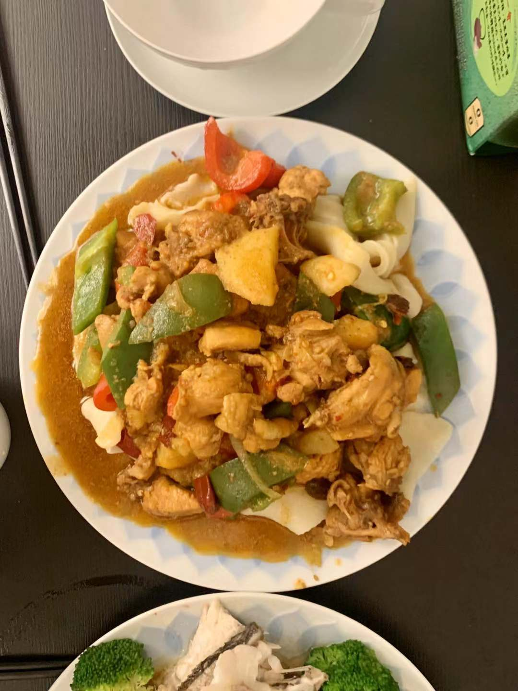

# 大盘鸡

## 材料

- 整鸡一只
- 土豆
- 青椒/红椒
- 啤酒
- 香醋
- 冰糖
- 老抽
- 大葱
- 生姜
- 蒜
- 干辣椒
- 碎辣椒
- 花椒
- 八角
- 桂皮
- 草果
- 香叶
- 宽面
- 孜然粉
- 豆瓣酱

### 宽面

- 中/高筋面粉
- 盐
- 温水

## 制作

### 备料

- 大葱斜切厚段和薄段，分开放置
- 生姜切片，大蒜拍碎
- 大蒜两颗切成蒜蓉
- 青红椒去籽切菱形块
- 土豆去皮滚刀块
- 干辣椒剪段
- 花椒掰散， 桂皮取小块，草果两颗，香叶三片
- 鸡肉切两厘米块

### 宽面

- 面粉加入少许盐
- 一边加入温水，一边用筷子搅拌到结块 （面：水=5:2）
- 面揉均匀
- 盖上保鲜膜醒半小时
- 再次揉面至光滑，搓成长条
- 切成均匀的小份，并揉成小条
- 放在刷过油的盘子上，再在面条上刷油
- 盖上保鲜膜再醒40分钟以上

### 鸡肉

- 锅烧热转小火炒糖色
- 倒入鸡肉，煸炒去水分
- 锅中腾出位置，加入八角，花椒和红油， 煸出香味
- 加入姜蒜，大葱段，干辣椒，炒香。 如果颜色过淡可加入少许老抽
- 倒入一瓶啤酒，开水，稍微没过鸡肉
- 加入草果，桂皮，少许孜然粉，一勺豆瓣酱
- 加入土豆搅拌均匀均匀
- 不用开盖小伙烧煮20~30分钟
- 加入少许糖提鲜，少许香醋
- 加入细大葱丝，蒜蓉
- 加入青红椒，洋葱块，稍微煮1分钟断生
- 出锅盖在煮好的面条上
