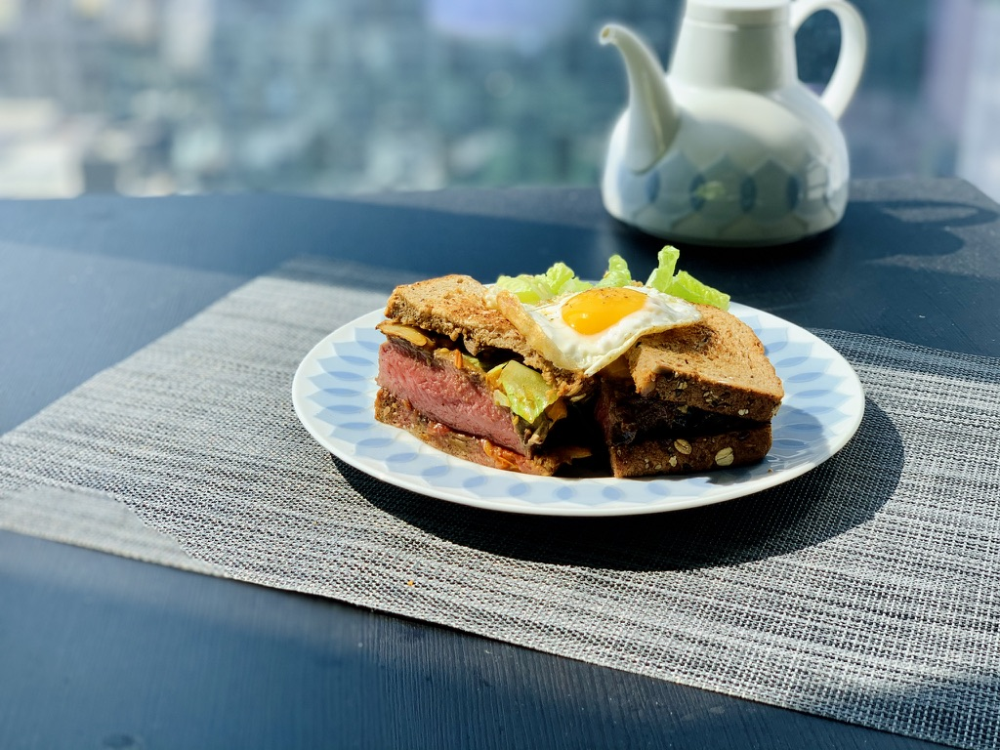

# 牛排三明治

## 材料

- 牛排(Top Sirloin / Ribeyes)
- 橄榄油
- 黄油
- 蒜
- 生菜
- 黑胡椒
- 百里香（Thyme）
- 小番茄（Gourmet Cherry Tomatos)
- 蘑菇
- 芥末酱（Yellow Mustard）
- 吐司面包

## 制作

### 牛排

- 将牛排外侧多余的肥肉和筋切去。牛排三明治食用的时候没法用刀切，外侧脂肪和筋十分印象食用体验。
- 制作前将牛排在放置30分钟确保内部温度不会过冷
- 制作牛排至四分熟(Medium Rare)
  - 用盐和黑胡椒将牛肉每面腌制
  - Sous Vide
    - 将牛肉放入密封袋
    - 加入拍碎的大蒜，现磨黑胡椒，橄榄油
    - 排出袋中空气密封
    - 用60°C 温水浸泡40分钟～1小时
    - 取出牛肉擦干
    - 锅烧热加入黄油，百里香，大蒜
    - 将牛排每面稍微煎制
  - 煎制（+ cast iron pan / grill pan)
    - 高温热锅，入油。等到稍微冒白烟加入牛排
    - 高温煎2～3分钟，加入黄油，大蒜，百里香并将牛排翻面
    - 用勺子反复将黄油淋到牛排上，再煎2～3分钟
    - 将牛排侧面也稍微煎收尾
- 将制作完成的牛排静置3分钟，同时开始制作酱料

## 酱料

- 小番茄对半切，一颗大蒜切成蒜蓉
- 锅中加入少许橄榄油烧热。加入蒜蓉和小番茄
- 转小火慢慢熬化小番茄。（入股味道不够可加入少许番茄酱料）
- 蘑菇切薄片加入锅中继续熬制。如果太干可以加入少许温水
- 待蘑菇熟透加入芥末酱，搅拌均匀备用

## 完成

- 在烤后的吐司面包上抹上制作好的酱料
- 放上牛排
- 取少许生菜叶，铺在牛排上
- 另一片吐司也抹上酱料，盖上
- 斜切或对半切开三明治，装盘
