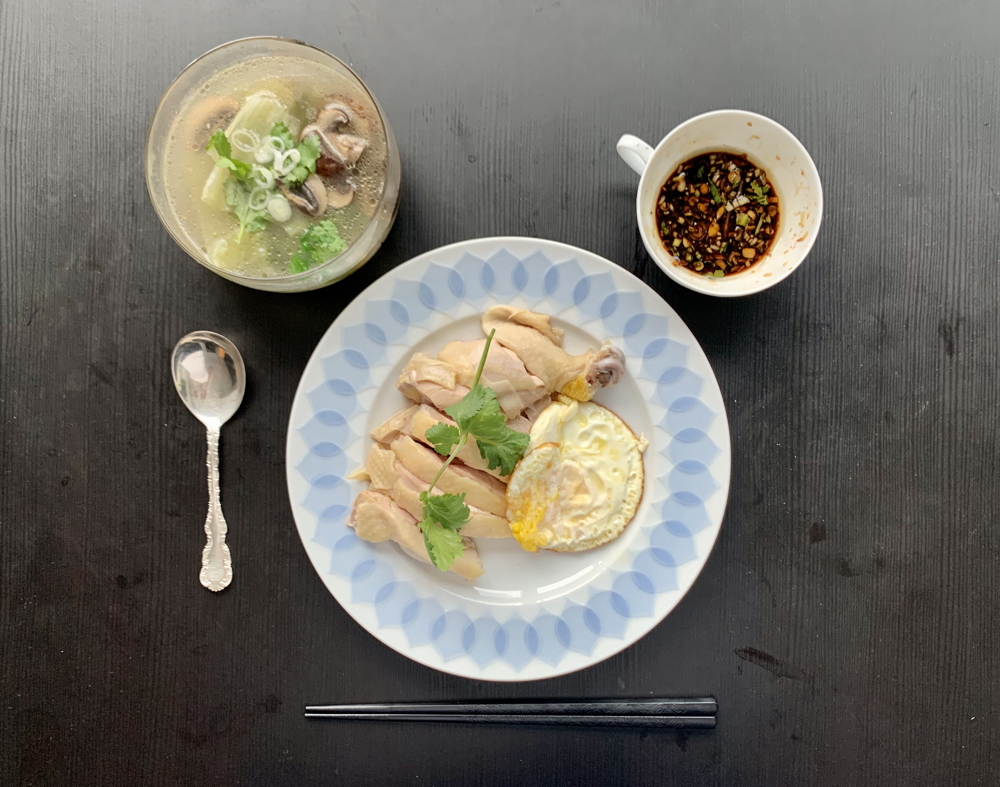

# 白斩鸡

## 材料

- 整鸡一只 或 带皮骨鸡腿肉
- 八角
- 小葱
- 姜
- 蒜
- 香菜（可选）
- 芝麻油
- 生抽
- 冰水一盆

## 蘸料

- 大蒜两头切碎蒜蓉
- 生姜一小块切成姜末
- 小葱取葱白切丝
- 香菜切碎（可选）
- 将香菜以外的材料放入小碗， 浇入热油带出香味。冷却后加入生抽酱油，芝麻油以及香菜搅拌均匀备用。

## 制作

- 锅中水烧开，放入八角，姜，蒜，葱白段，倒入少许麻油
- 鸡肉不要直接放入锅中煮制。将鸡放入锅中再提出，反复4～5次；或者用勺子将烫水多次浇在鸡肉身上。 此步骤防止鸡皮破裂。
- 转中火，将鸡肉完全浸入锅中煮制10～15分钟。
- 关火盖上锅盖继续焖制15～20分钟。
- 将鸡肉从锅中去除立刻放入准备好的冰水；冷却20分钟提高口感增加鸡皮弹性。
- 待鸡完全冷却后取出晾干即可切块装盘。

## 杂项

- 煮鸡的汤可以加入蔬菜，少许调味制作一道蔬菜鸡汤
- 鸡胸肉如果过柴可以切出拔丝加入汤中或者制作凉拌鸡丝
